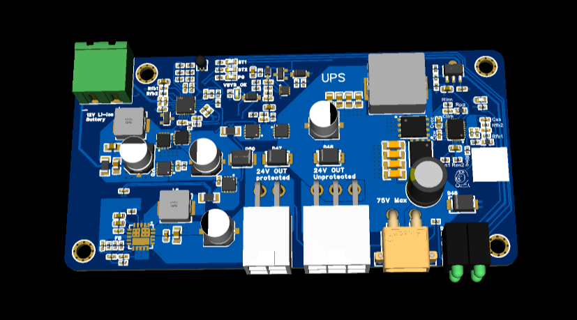

UPS
===

| **Warning:** A WORK in PROGRESS

This project holds two boards:

Common Features:

* **75V to 24V buck converter**: Active current Limit (Default 6A, adjustable).
* **12V battery charger**: 1A charge current (can be adjusted to 6A max).

The difference:

* Without booster: When power is lost, the protected output will change from 24V to the battery's voltage(12-9V).
* With booster: When power is lost, the protected output will be 24V contant. Because the booster will drain current even if no load is connected, to avoid draining the battery, the output will be shutdown after some adjustable time.

| Board  |   24V Output  | Protected Output | 12V battery charger | Delayed Shutdown |
| ----- | ----- | ----- | ---- | ---- |
| Without Booster | Yes | 24V or 12V   | Yes | No |
| With Booster   | Yes | 24V stable | Yes | Yes |

